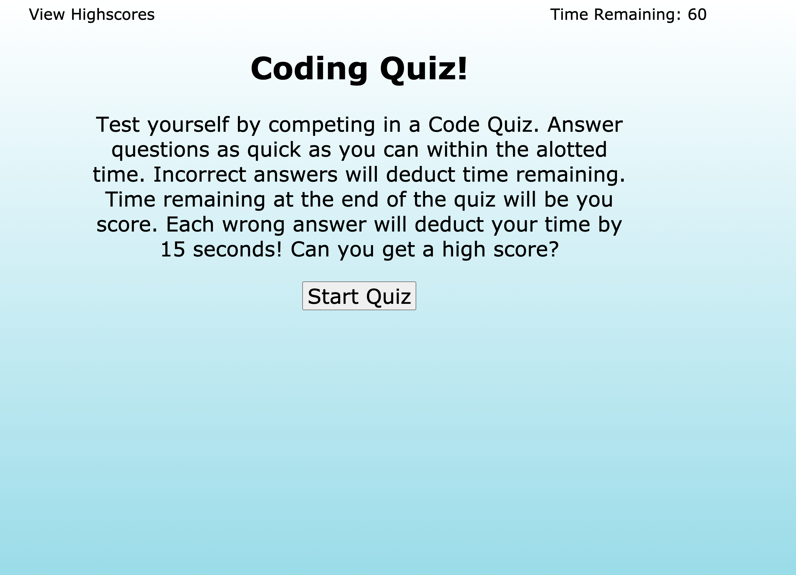

# Code Quiz
-- Unit 4 Homework 1 -- Zack Campbell

## Description

Using javascript and web APIs, we set out to create a basic quiz to test coding knowledge. There were several elements in play including a decrementing timer which gets lowered even more for each wrong answer. There's also a high scores list using the browser's local storage so it persists if the user returns to the page at a later time.

## Installation

Another pretty basic webpage, so nothing to install. The repository is public to feel free to grab any of the files or take a look at the finished product [here.](https://zax5021.github.io/Code-Quiz/)

## Screenshots

## License
[MIT](https://choosealicense.com/licenses/mit/)